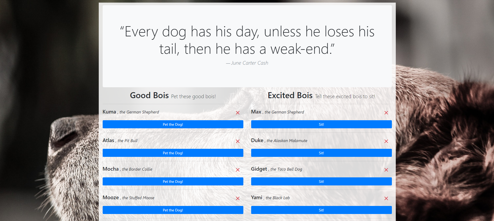
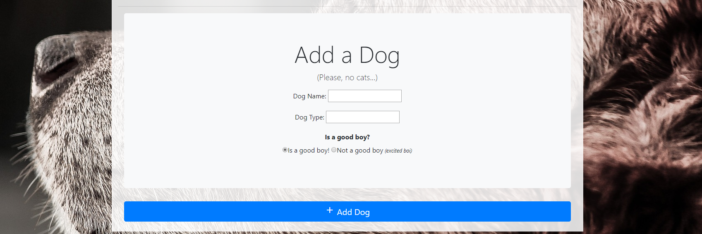

# Pet-Da-Dog

`Pet-Da-Dog` is a full-stack web application that allows the user to post new dogs to the database, update their status as good or excited *bois*, or remove dogs from the database altogether. 

I made `Pet-Da-Dog` as an assignment for the UC Berkeley Coding bootcamp in order to demonstrate the ability to deploy a fully-functional full-stack application (developed in MVC architecture), utilizing both front-end and back-end technologies I've learned how to use thus far. 
#### [Link to Deployed Application](https://lit-bayou-89965.herokuapp.com/)

---
## Code Explanation/Application Flow

`Pet-Da-Dog` is structured upon Model-View-Controller (MVC) architecture, and as such, the flow of the application is directly dictated by the MVC pattern.

* __(View)__ The user loads the application and automatically sends a GET request to the controller upon page load. 

    * In the case of `Pet-Da-Dog` the user's page is populated with all of the dogs stored in the database as well as different actions that can be taken to manipulate that data *(GET, POST, PUT, & DELETE requests).*

* __(Controller)__ The controller refers to the model/ORM to construct a the correct query according to the path selected by the user action.

    * jQuery event listeners are established to define the path depending on which button is pressed. eg. If the `+Add Dog` button on the bottom form is clicked, the request is identified as a POST request, whereas if the `'Sit!'` or `'Pet the Dog!'` buttons are pressed, the event listener identifies it as a PUT (or update) request.

* __(Model)__ The model receives the type request being made and structures a query to the SQL database/server to then relay it back to the user with the correct response

    * The model receives user input and structures the requests accordingly. If the user chooses to add a new dog, the user input for the dog name/type are passed to the model to create the correct SQL query to POST a new dog to the database with those values.

* __(View)__ The user's page is then updated with data according to the query made to the server.

    * By passing through the controller and model, the data from the SQL database is formatted into an object that can then be accessed and rendered onto the HTML page, in the case of this application, we use `express-handlebars` to leverage the object data and display it to the user.

---
##  Technologies Used

### HTML5

### CSS3
*   [Bootstrap CSS Library](https://getbootstrap.com/)

### Javascript
*   [jQuery JS Library](https://jquery.com/)

### MySQL (https://www.mysql.com/)
*   MySQL Workbench

### Node.js (https://nodejs.org/)
*   [Express.js](https://expressjs.com/)
*   [Handlebars.js](https://handlebarsjs.com/)
*   [Express Handlebars](https://www.npmjs.com/package/express-handlebars)
*   [Node Package Manager (NPM)](https://www.npmjs.com/)

### Heroku (https://www.heroku.com/)
* [JawsDB](https://elements.heroku.com/addons/jawsdb)

### Git
* [Github](https://github.com/)

